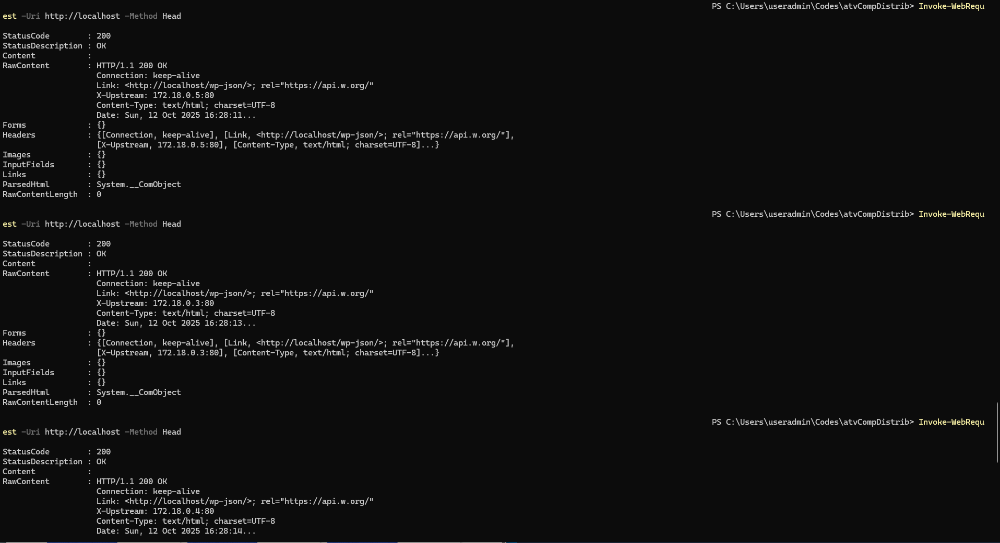

# 🐳 Configuração do WordPress com Múltiplas Instâncias Utilizando Nginx e Docker Compose

## 📘 Descrição do Trabalho

Este projeto tem como objetivo **configurar múltiplas instâncias do WordPress** utilizando **Docker Compose** e **Nginx** como **balanceador de carga**, de forma a aumentar a **escalabilidade e disponibilidade** da aplicação.

Cada instância do WordPress compartilha o mesmo **banco de dados MySQL** e a mesma **pasta de conteúdo** (`/var/www/html`), garantindo que todas exibam o mesmo conteúdo, independentemente da instância que atenda à requisição.

---

## 👩‍💻 Equipe

- **Maria Iana**  
- **Matheus Alves**

---

**Serviços:**

| Container    | Imagem                         | Função                          |
|---------------|--------------------------------|----------------------------------|
| `nginx`       | nginx:1.19.0                   | Balanceador de carga             |
| `wordpress1`  | wordpress:5.4.2-php7.2-apache  | Instância 1 do WordPress         |
| `wordpress2`  | wordpress:5.4.2-php7.2-apache  | Instância 2 do WordPress         |
| `wordpress3`  | wordpress:5.4.2-php7.2-apache  | Instância 3 do WordPress         |
| `mysql`       | mysql:5.7                      | Banco de dados compartilhado     |

---

## 🚀 Como Executar

### 1️⃣ Subir os containers

```bash
docker-compose up -d

### 2️⃣ Testar o balanceamento de carga Nginx
Invoke-WebRequest -Uri http://localhost -Method Head

<p align="center">
  
</p>
